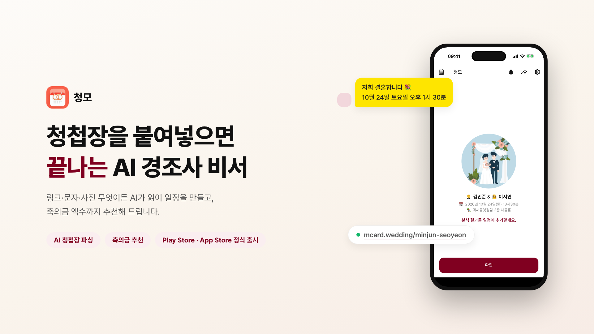
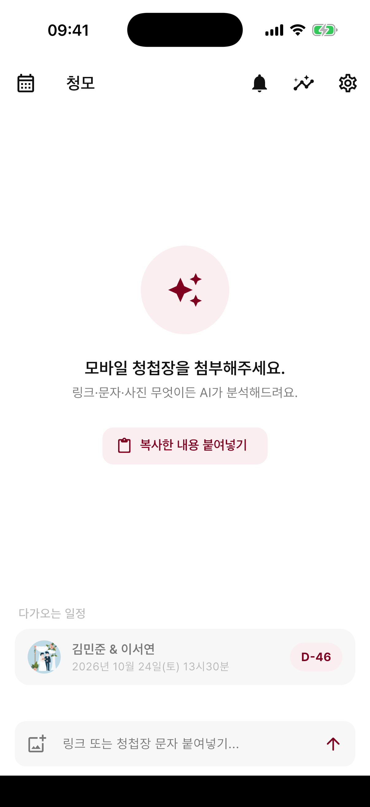
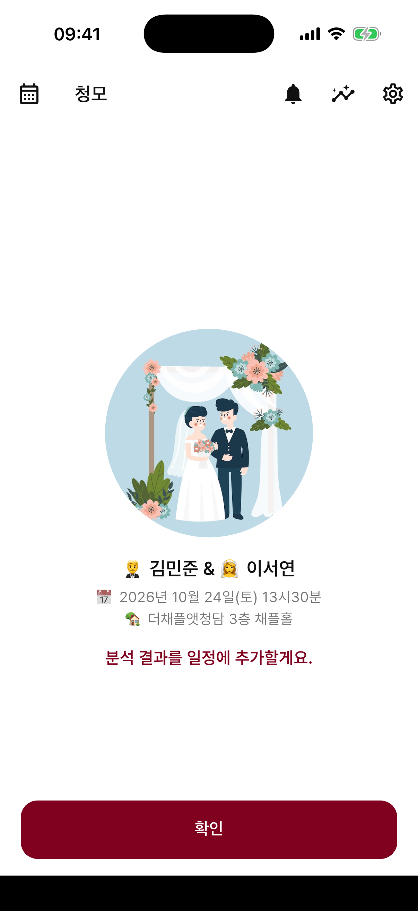
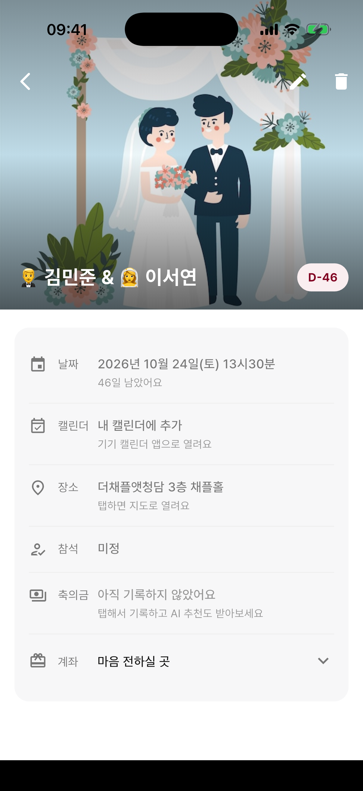
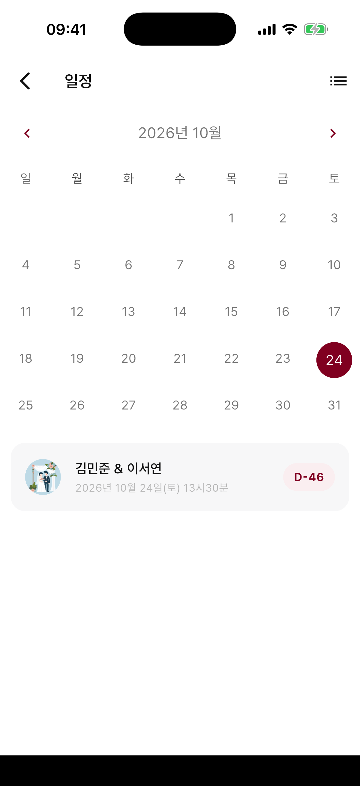
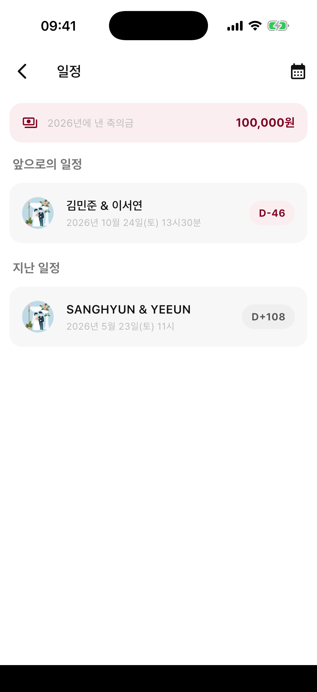
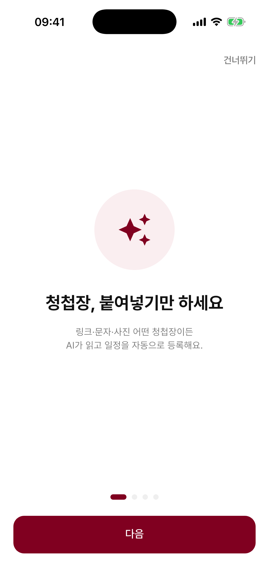
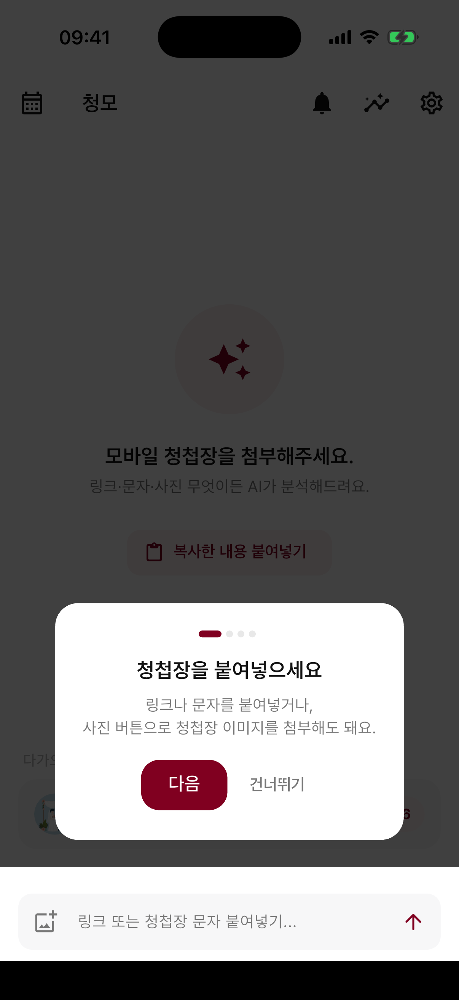
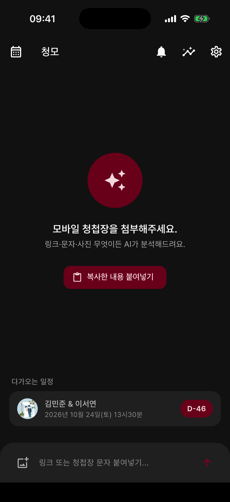

<!-- README.ko.md -->

[English](./README.md)

# 청모: AI 경조사 비서



<p align="center">
  <strong>링크, 카톡 캡처, 안내 문자 — 청첩장을 붙여넣으면 AI가 축의금 계좌까지 읽어 일정으로 만들어 주는 앱입니다.</strong>
</p>

<p align="center">
  <a href="https://play.google.com/store/apps/details?id=com.taebbong.chungmo">
    
  </a>
  <a href="https://apps.apple.com/kr/app/id6745786004">
    
  </a>
  <a href="https://chung-mo.web.app">
    
  </a>
</p>

## 기능

- **AI 청첩장 파싱 — 링크·사진·텍스트**
  - 모바일 청첩장 URL을 붙여넣거나, 카톡 캡처·종이 청첩장 사진을 공유하거나, 안내 문자를 그대로 붙여넣으면 Gemini(Firebase AI Logic)가 신랑·신부, 일시, 장소, 양가 축의금 계좌를 추출합니다. 세 경로가 하나의 구조화 출력 스키마를 공유합니다 (`lib/data/sources/remote/invitation_prompt.dart`).
  - 링크는 자체 크롤러(`lib/core/utils/crawler.dart`)가 처리합니다: 문서 순서 텍스트 워크, OpenGraph 메타, EUC-KR 디코딩, 같은 호스트 iframe 추적, CSR 셸 JSON 폴백.
  - 날짜가 없는 청첩장은 실패 대신 부분 추출 결과가 직접 입력 폼에 프리필됩니다.
- **OS 공유 시트 연동**
  - 다른 앱에서 "공유 → 청모"로 바로 분석을 시작합니다 (Android Share Intent / iOS Share Extension).
- **AI 축의금 추천**
  - 관계와 친밀도를 적으면 내 과거 기록 통계와 공개 설문 데이터를 근거로 금액과 이유를 함께 제안합니다.
- **기록과 통계**
  - 결혼식별 참석 여부·낸 금액을 기록하고 연도별·관계별 차트로 봅니다 (`lib/presentation/pages/stats_page.dart`).
- **일정 주변까지**
  - 다가오는 예식 D-day 홈 위젯(Android/iOS), 전날 푸시 알림, 탭 한 번 기기 캘린더 등록, 계좌번호 탭 복사, 클립보드 링크 감지.

### 측정된 정확도

파서는 직접 구축한 벤치마크로 검증합니다: 실제 벤더 마크업 스타일 15종을 재현한 가상 청첩장 38건을 [chung-mo.web.app/eval](https://chung-mo.web.app)에 호스팅하고 자동 채점기로 채점합니다.

| | 수치 |
|---|---|
| 핵심 필드 완전 정확도 (수정 없이 저장되는 비율) | **100%** (38/38) |
| 필드별 — 이름 · 일시 · 장소 · 계좌 | 각 100% |
| 여정 | 63% → 85% (크롤러 재작성) → 100% (연도 추론, CSR JSON 추적) |

구축·채점 방식: [docs/PARSING_EVAL.md](./docs/PARSING_EVAL.md), [docs/CRAWLER_COVERAGE.md](./docs/CRAWLER_COVERAGE.md).

### 앱 스크린샷

|  |  |  |  |
| --- | --- | --- | --- |
|  |  |  |  |

## 시작하기

### 요구사항

- [Flutter SDK](https://flutter.dev/docs/get-started/install) — 버전은 [fvm](https://fvm.app)으로 고정되어 있습니다 (`.fvmrc`)
- 본인 소유의 Firebase 프로젝트: 앱이 Firebase AI Logic, App Check, Analytics, Crashlytics에 의존하므로 `flutterfire configure`로 `firebase_options.dart`와 플랫폼 설정 파일을 생성해야 합니다
- 디버그 빌드에서 AI 호출을 쓰려면 첫 실행 시 콘솔에 출력되는 App Check 디버그 토큰을 등록하세요 (Firebase console → App Check → Manage debug tokens)

### 설치

1.  저장소 복제:

    ```bash
    git clone https://github.com/TaeBbong/chungmo-app.git
    cd chungmo-app
    ```

2.  의존성 설치:

    ```bash
    fvm flutter pub get
    ```

3.  코드 생성기 실행:

    ```bash
    fvm dart run build_runner build --delete-conflicting-outputs
    ```

4.  앱 실행:
    ```bash
    fvm flutter run
    ```

## 설정

### 환경 설정

환경은 아직 정적 클래스로 선택합니다 (Flavor/`dart-define` 전환이 로드맵에 있습니다). `main.dart`가 빌드 모드에 따라 환경을 고릅니다:

```dart
/// lib/core/env.dart (발췌)
enum Environ { local, dev, production }

enum RemoteSourceEnv { firebase, cloud }

class Env {
  static void init(
      {required Environ environment, required RemoteSourceEnv remoteSource}) {
    // 레거시 클라우드 엔드포인트와 DI backendType을 결정
  }
}
```

`RemoteSourceEnv.firebase`가 실제 배포 경로(Firebase AI Logic)이고, `cloud`는 레거시 GPT 백엔드 구현을 DI로 선택할 수 있게 남겨둔 것입니다.

## 프로젝트 아키텍처

이 프로젝트는 관심사를 분리하고 확장 가능하며 유지보수하기 쉬운 코드베이스를 만들기 위해 **클린 아키텍처**를 기반으로 합니다. 프레젠테이션 레이어는 상태 관리를 위해 **Bloc** 패턴을 사용하여 구축되었습니다.

```css
📂 core/
   ├── utils/       (크롤러, 이미지 전처리, 확장 함수)
   ├── di/          (의존성 주입 설정)
   ├── navigation/  (라우팅 로직)
   └── services/    (알림, 홈 위젯, 애널리틱스)

📂 data/
   ├── sources/     (로컬·원격 데이터 소스, AI 프롬프트)
   ├── repositories/ (도메인 리포지토리 구현체)
   ├── models/      (데이터 전송 객체)
   └── mapper/      (모델과 엔티티 간 매퍼)

📂 domain/
   ├── entities/    (순수 도메인 모델)
   ├── repositories/ (추상 리포지토리 인터페이스)
   ├── usecases/    (특정 작업을 위한 비즈니스 로직)

📂 presentation/  (UI 레이어)
   ├── bloc/        (상태 관리를 위한 Bloc 및 Cubit)
   ├── pages/       (UI 화면/페이지)
   ├── widgets/     (재사용 가능한 UI 컴포넌트)
   └── theme/       (앱 테마, 팔레트, 모션 토큰)

📂 main.dart      (애플리케이션 진입점)
```

`lib/` 밖에는 파싱 벤치마크(`eval/` — 데이터셋, 러너, 채점기), Firebase Hosting으로 서빙되는 정적 사이트와 평가 픽스처(`hosting/public/`, [chung-mo.web.app](https://chung-mo.web.app)), 그리고 `docs/` 아래의 기술 문서(isolate, 마이크로 인터랙션, 크롤러 커버리지, 파싱 평가, 호스팅, 애널리틱스, 릴리스 체크리스트)가 있습니다.

데이터 흐름은 의존성 주입(`get_it` 및 `injectable`)에 의해 조율되며, UI에서 데이터 레이어로 명확한 단방향 패턴을 따릅니다.

```txt
┌────────────────────────── UI (Bloc) ──────────────────────────┐
│  View (Widget)                                                │
│     ├──> Bloc / Cubit (상태 관리)                               │
│     │     ├──> UseCase (비즈니스 로직)                           │
│     │     │     ├──> Repository (인터페이스)                     │
│     │     │     │     ├──> Remote Data Source (Firebase AI)    │
│     │     │     │     └──> Local Data Source (SQLite)          │
│     │     │     │                                              │
└───────> 의존성 주입 (get_it + injectable) ───────────────────────┘
```

## 릴리스 내역

버전 변경에 대한 자세한 정보는 [릴리스 노트](./RELEASE.ko.md) 또는 [GitHub Releases](https://github.com/TaeBbong/chungmo-app/releases)를 참조하세요.

## 의존성

이 프로젝트는 다음과 같은 여러 핵심 패키지를 사용합니다:

- Firebase AI Logic을 통한 Gemini 호출: `firebase_ai` (+ `firebase_app_check`)
- 상태 관리를 위한 `flutter_bloc`
- 의존성 주입을 위한 `get_it` 및 `injectable`
- 로컬 데이터베이스 저장을 위한 `sqflite`
- 캘린더 UI를 위한 `table_calendar`
- 위젯·차트·공유 시트·캘린더 연동: `home_widget`, `fl_chart`, `receive_sharing_intent`, `add_2_calendar`

전체 의존성 목록은 [`pubspec.yaml`](./pubspec.yaml) 파일에서 확인할 수 있습니다.

## 라이선스

Copyright © 2026 TaeBbong. 소스는 열람·참고용으로 공개되어 있습니다.
