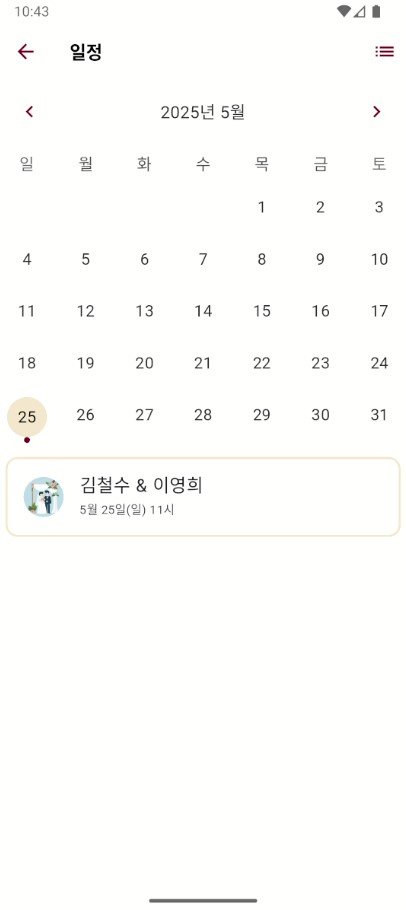

<!-- README.ko.md -->

[English](./README.md)

# 청모: AI 기반 청첩장 분석기


<p align="center">
  <strong>모바일 청첩장 링크를 첨부하면 GPT가 일정을 파싱하여 캘린더에 등록하는 앱입니다.</strong>
</p>

<p align="center">
  <a href="https://play.google.com/store/apps/details?id=com.taebbong.chungmo">
    
  </a>
  <a href="">
    
  </a>
</p>

## 기능


- **AI 기반 일정 분석**
  - 사용자가 청첩장 URL을 제출하면, 앱이 서버로 링크를 보내 AI 기반으로 콘텐츠를 분석하고 자동으로 일정 상세 정보를 추출합니다. 이 과정은 `lib/domain/usecases/analyze_link_usecase.dart`에서 처리되며, UI는 `lib/presentation/bloc/create/create_cubit.dart`를 통해 반영됩니다.
- **캘린더 & 목록 뷰**
  - 저장된 모든 일정을 캘린더 또는 목록 형태로 볼 수 있습니다. 이 UI 로직은 `lib/presentation/bloc/calendar/calendar_bloc.dart`에서 관리되며, `lib/presentation/widgets/calendar_view.dart`와 `lib/presentation/widgets/calendar_list_view.dart` 같은 위젯을 사용합니다. 날짜를 탭하면 요약 정보가, 이벤트를 탭하면 상세 페이지로 이동합니다.
- **일정 관리**
  - 일정 상세 정보를 보고, 수정하고, 삭제할 수 있습니다. `DetailPage`에서 수정을 할 수 있으며, 이는 `lib/domain/usecases/edit_schedule_usecase.dart`와 `lib/domain/usecases/delete_schedule_usecase.dart` 같은 유스케이스를 통해 처리됩니다.
- **푸시 알림**
  - `lib/core/services/notification_service.dart`에 설정된 로컬 푸시 알림을 통해 예정된 이벤트(예: 하루 전)에 대한 시기적절한 알림을 제공합니다.
- **클립보드 감지**
  - 앱이 사용자의 클립보드에서 청첩장 링크를 자동으로 감지하고 제안하여 생성 과정을 간소화합니다.

### 앱 스크린샷

|  |  |      |  |
| ------------------------------------- | ----------------------------------------- | --------------------------------------- | -------------------------------------- |
|  |        |  |     |
|  |        |                                         |                                        |

## 시작하기

### 요구사항

- [Flutter SDK](https://flutter.dev/docs/get-started/install)
- [VS Code](https://code.visualstudio.com/) 또는 [Android Studio](https://developer.android.com/studio)와 같은 에디터

### 설치

1.  저장소 복제:

    ```bash
    git clone https://github.com/your-username/chungmo-app.git
    cd chungmo-app
    ```

2.  의존성 설치:

    ```bash
    dart pub get
    ```

3.  코드 생성기 실행:

    ```bash
    dart run build_runner build --delete-conflicting-outputs
    ```

4.  앱 실행:
    ```bash
    flutter run
    ```

## 설정

### 환경 설정

이 프로젝트는 정적 클래스를 통해 환경(local, dev, production)을 관리하는 임시 하드코딩 방식을 사용합니다.

```dart
/// lib/core/env.dart
/// Temporary way to seperate environments.
/// TODO: Apply Flavor to native env
enum Environ { local, dev, production }

class Env {
  static late final Environ env;
  static late final String url;

  static void init(Environ environment) {
    env = environment;
    switch (environment) {
      case Environ.local:
        url = 'https://local-api.example.com';
        break;
      case Environ.dev:
        url = 'https://dev-api.example.com';
        break;
      case Environ.production:
        url = 'https://api.example.com';
        break;
    }
  }
}
```

환경을 설정하려면 `lib/main.dart`와 같은 애플리케이션 시작 지점에서 `Env.init()`를 호출하세요.

## 프로젝트 아키텍처

이 프로젝트는 관심사를 분리하고 확장 가능하며 유지보수하기 쉬운 코드베이스를 만들기 위해 **클린 아키텍처**를 기반으로 합니다. 프레젠테이션 레이어는 상태 관리를 위해 **Bloc** 패턴을 사용하여 구축되었습니다.

```css
📂 core/
   ├── utils/       (공통 유틸리티 함수)
   ├── di/          (의존성 주입 설정)
   ├── navigation/  (라우팅 로직)
   └── services/    (알림과 같은 백그라운드 서비스)

📂 data/
   ├── sources/     (로컬 및 원격 데이터 소스)
   ├── repositories/ (도메인 리포지토리 구현체)
   ├── models/      (데이터 전송 객체)
   └── mapper/      (모델과 엔티티 간 매퍼)

📂 domain/
   ├── entities/    (순수 도메인 모델)
   ├── repositories/ (추상 리포지토리 인터페이스)
   ├── usecases/    (특정 작업을 위한 비즈니스 로직)

📂 presentation/  (UI 레이어)
   ├── bloc/        (상태 관리를 위한 Bloc 및 Cubit)
   ├── pages/       (UI 화면/페이지)
   ├── widgets/     (재사용 가능한 UI 컴포넌트)
   └── theme/       (앱 테마 및 스타일링)

📂 main.dart      (애플리케이션 진입점)
```

데이터 흐름은 의존성 주입(`get_it` 및 `injectable`)에 의해 조율되며, UI에서 데이터 레이어로 명확한 단방향 패턴을 따릅니다.

```txt
┌────────────────────────── UI (Bloc) ──────────────────────────┐
│  View (Widget)                                                │
│     ├──> Bloc / Cubit (상태 관리)                               │
│     │     ├──> UseCase (비즈니스 로직)                           │
│     │     │     ├──> Repository (인터페이스)                     │
│     │     │     │     ├──> Remote Data Source (API)           │
│     │     │     │     └──> Local Data Source (SQLite)         │
│     │     │     │                                             │
└───────> 의존성 주입 (get_it + injectable) ───────────────────────┘
```

## 릴리스 내역

버전 변경에 대한 자세한 정보는 [릴리스 노트](./RELEASE.ko.md)를 참조하세요.

## 의존성

이 프로젝트는 다음과 같은 여러 핵심 패키지를 사용합니다:

- 상태 관리를 위한 `flutter_bloc`
- 의존성 주입을 위한 `get_it` 및 `injectable`
- 네트워킹을 위한 `dio`
- 로컬 데이터베이스 저장을 위한 `sqflite`
- 캘린더 UI를 위한 `table_calendar`

전체 의존성 목록은 [`pubspec.yaml`](./pubspec.yaml) 파일에서 확인할 수 있습니다.

## 라이선스

이 프로젝트는 오픈 소스입니다. 자세한 내용은 라이선스 파일을 확인하세요.
