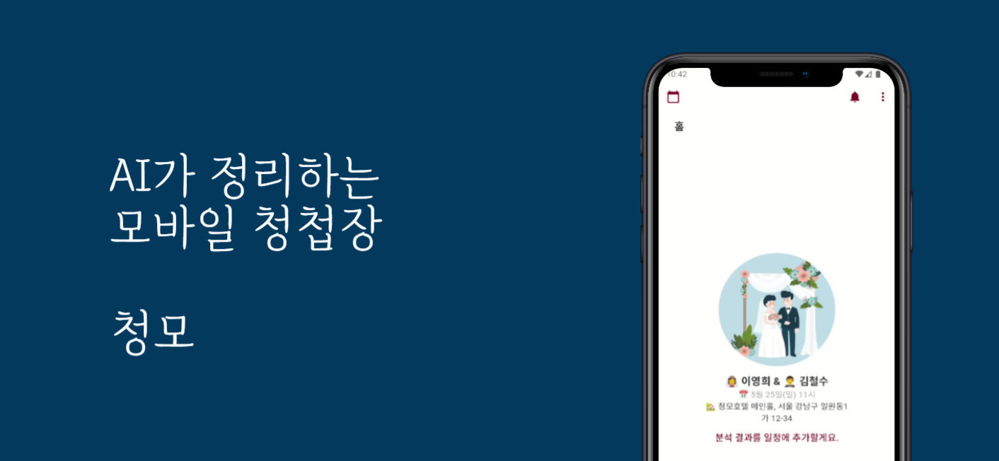
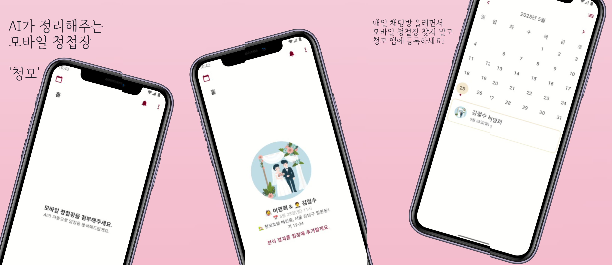

# _chungmo_ project with clean architecture



모바일 청첩장 링크를 첨부하면 GPT가 일정을 파싱하여 캘린더에 등록하는 앱입니다.

<a href="">

</a>
<a href="https://play.google.com/store/apps/details?id=com.taebbong.chungmo">

</a>

## Features



1. CreatePage : 사용자가 링크를 입력하면 -> 서버에 링크를 보내 컨텐츠를 파싱/분석하며 그동안 로딩 애니메이션 보여줌 -> 서버로부터 결과 나오면 결과를 보여주며 해당 결과를 로컬 저장소(db)에 저장
2. CalendarPage : CreatePage 왼쪽 상단 달력 아이콘 버튼을 통해 접근됨.
   달력 위젯으로 채워진 페이지 -> 로컬 저장소에 저장된 일정 정보를 바탕으로 달력 위젯에 보여줌 -> 우측 상단 버튼을 통해 달력 <-> 목록으로 보여주는 방식 전환 가능 -> 날짜를 탭하면 해당 날짜에 등록된 간략한 일정 정보(ListTile)를 bottom sheet으로 보여줌 -> 각 일정을 탭하면 DetailPage로 이동
3. DetailPage : 일정에 대한 자세한 정보를 제공 -> 우측상단 수정하기 버튼을 통해 일정을 수정 가능
4. 그 외 : 푸시알림 기능을 통해 일정이 임박했을 때(전날) 앱 푸시 알림을 제공

### App Screenshots

|  |  |      |  |
| ------------------------------------- | ----------------------------------------- | --------------------------------------- | -------------------------------------- | --- | ---------------------- | ---------------------- | ---------------------- | ---------------------- |
|  |        |  |     |     | ---------------------- | ---------------------- | ---------------------- | ---------------------- |
|  |        |                                    |                                   |

## Get Started

### env.dart

임시방편 : env.dart, static을 통한 전역 변수화

```dart
/// core/env.dart
/// Temporary way to seperate environments.
/// TODO: Apply Flavor to native env
enum Environ { local, dev, production }

class Env {
  static late final Environ env;
  static late final String url;

  static void init(Environ environment) {
    env = environment;
    switch (environment) {
      case Environ.local:
        url = 'https://local-api.example.com';
        break;
      case Environ.dev:
        url = 'https://dev-api.example.com';
        break;
      case Environ.production:
        url = 'https://api.example.com';
        break;
    }
  }
}
```

## Project Architecture

Based on clean architecture

```css
📂 core/
   ├── utils/       (공통 유틸 함수)
   ├── errors/      (예외 처리)
   ├── network/     (네트워크 관련 설정)

📂 data/
   ├── datasources/ (로컬, 원격 데이터 소스)
   ├── repositories/ (Repository 구현체)
   ├── models/      (데이터 모델)

📂 domain/
   ├── entities/    (순수 도메인 모델)
   ├── repositories/ (추상 Repository)
   ├── usecases/    (비즈니스 로직)

📂 presentation/  (UI 계층)
   ├── controllers/ (GetX의 Controller 또는 ViewModel)
   ├── pages/       (화면 UI)
   ├── widgets/     (재사용 가능한 UI 컴포넌트)
   ├── themes/      (앱 테마 관리)

📂 di/              (의존성 주입)
📂 main.dart
```

```txt
┌────────────────────────── UI (MVVM) ──────────────────────────┐
│  View (StatelessWidget)                                        │
│     ├──> ViewModel (Controller, GetX)                         │
│     │     ├──> UseCase (Business Logic)                       │
│     │     │     ├──> Repository (Interface)                   │
│     │     │     │     ├──> Remote Data Source (API, Firebase) │
│     │     │     │     ├──> Local Data Source (SQLite, Hive)   │
│     │     │     │     ├──> Cache (SharedPrefs, SecureStorage) │
│     │     │     │                                              │
└───────> Dependency Injection (get_it + injectable) ───────────┘
```

## Todo

### refact

- [-] pages 정리(about 등)
- [ ] controller에서 initial fetch 하는 방법 바꾸기(Stateful => controller의 onInit)
  - onInit은 Get.put 시점에 실행됨 => 위젯 빌드보다 먼저 호출됨(왜냐면 Get.put의 시점 => 위젯 클래스 객체 생성 시점)
  - Worker의 ever, debounce 이런거는 용도에 맞게 나중에 써보자
  - GetX 문서, 레포를 좀 더 공부해볼 필요가 있을듯.. 이걸 다 하면 GetX 졸업
- [ ] 객체지향 컨셉 좀 더 적극적으로 써보기
  - https://velog.io/@ximya_hf 이걸 참고해라..
  - [ ] mixin(상속 없이 객체 기능 추가)
  - [ ] factory(비슷한 위젯),
  - [-] single import,
  - [-] extension type
  - [ ] part/extension(viewmodel 분할)
  - [-] static util 클래스에 abstract, private constructor 적용
  - [ ] baseview, baseviewmodel 만들기?
  - [-] base usecase도 만들 수 있겠지?(abstract interface, implements)
- [ ] Isolate 활용(어디서?)
  - 복잡한 위젯 빌드와 대용량 이미지 로드할 때 적용함(보통의 경우 불필요)
  - 그래도 걍 적용해보자(lottie랑 api call 동시에 해야하는 CreatePage / 이미지들 로드 해야하는 CalendarPage)
- 리팩토링 건마다 블로그 하나씩?

- [-] 1차 리팩토링 완료

### 1.0.1+2 배포 준비

- [-] entity의 date는 DateTime으로 정리, mapper에서 string <-> DateTime 수행하게끔
- [ ] showcaseview 기반 온보딩 튜토리얼 만들기
- [ ] 메인 페이지에서 등록된 일정 일부 보여지게끔
- [ ] 푸시 알림 권한 강조 요청
- [ ] iOS 배포를 위한 테스트

### 1.1.0+3 배포 준비

- [ ] 계좌 정보 파싱/추가

## Release Note

### Versioning

- [1.0.0+1]() 출시 완료(25.03.27.)

## Depends on

사용중인 패키지

## License

오픈소스 라이센스
