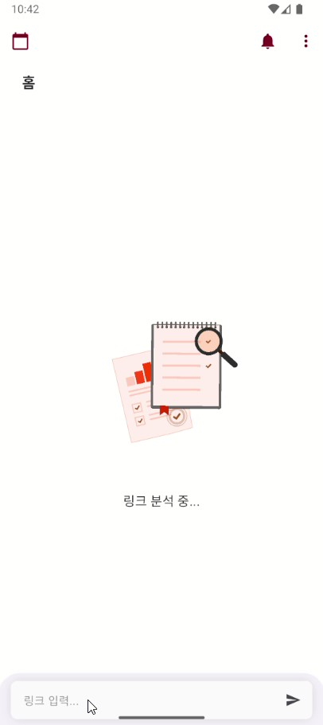

<!-- README.md -->

[한국어](./README.ko.md)

# chungmo: AI-Powered Wedding Invitation Parser


<p align="center">
  <strong>Mobile wedding invitation parser app using GPT API</strong>
</p>

<p align="center">
  <a href="https://play.google.com/store/apps/details?id=com.taebbong.chungmo">
    
  </a>
  <a href="">
    
  </a>
</p>

## Features


- **AI-Powered Schedule Parsing**: Users can submit a wedding invitation URL. The app sends the link to a server for AI-powered content analysis and automatically extracts event details. This process is handled by `lib/domain/usecases/analyze_link_usecase.dart` and reflected in the UI via `lib/presentation/bloc/create/create_cubit.dart`.
- **Calendar & List View**: View all saved schedules on a calendar or as a list. The UI logic for this is managed by `lib/presentation/bloc/calendar/calendar_bloc.dart`, with widgets like `lib/presentation/widgets/calendar_view.dart` and `lib/presentation/widgets/calendar_list_view.dart`. Tapping a date shows a summary, and tapping an event navigates to the detail page.
- **Schedule Management**: View, edit, and delete schedule details. The `DetailPage` allows for modifications, which are processed by use cases such as `lib/domain/usecases/edit_schedule_usecase.dart` and `lib/domain/usecases/delete_schedule_usecase.dart`.
- **Push Notifications**: The app provides timely reminders for upcoming events (e.g., the day before) using local push notifications, configured in `lib/core/services/notification_service.dart`.
- **Clipboard Detection**: The app automatically detects and suggests a wedding invitation link from the user's clipboard to streamline the creation process.

### App Screenshots

|  |  |      |  |
| ------------------------------------- | ----------------------------------------- | --------------------------------------- | -------------------------------------- |
|  |        |  |     |
|  |        |                                         |                                        |

## Get Started

### Prerequisites

- [Flutter SDK](https://flutter.dev/docs/get-started/install)
- An editor like [VS Code](https://code.visualstudio.com/) or [Android Studio](https://developer.android.com/studio)

### Installation

1.  Clone the repository:

    ```bash
    git clone https://github.com/your-username/chungmo-app.git
    cd chungmo-app
    ```

2.  Install dependencies:

    ```bash
    flutter pub get
    ```

3.  Run the code generator:

    ```bash
    dart run build_runner build --delete-conflicting-outputs
    ```

4.  Run the app:
    ```bash
    flutter run
    ```

## Configuration

### Environment Setup

The project uses a temporary, hard-coded method for managing environments (local, dev, production) via a static class.

```dart
/// lib/core/env.dart
/// Temporary way to seperate environments.
/// TODO: Apply Flavor to native env
enum Environ { local, dev, production }

class Env {
  static late final Environ env;
  static late final String url;

  static void init(Environ environment) {
    env = environment;
    switch (environment) {
      case Environ.local:
        url = 'https://local-api.example.com';
        break;
      case Environ.dev:
        url = 'https://dev-api.example.com';
        break;
      case Environ.production:
        url = 'https://api.example.com';
        break;
    }
  }
}
```

To set an environment, call `Env.init()` at the start of the application, for example in `lib/main.dart`.

## Project Architecture

This project is based on **Clean Architecture** to separate concerns and create a scalable, maintainable codebase. The presentation layer is built using the **Bloc** pattern for state management.

```css
📂 core/
   ├── utils/       (Common utility functions)
   ├── di/          (Dependency injection setup)
   ├── navigation/  (Routing logic)
   └── services/    (Background services like notifications)

📂 data/
   ├── sources/     (Local and remote data sources)
   ├── repositories/ (Implementation of domain repositories)
   ├── models/      (Data Transfer Objects)
   └── mapper/      (Mappers between models and entities)

📂 domain/
   ├── entities/    (Pure domain models)
   ├── repositories/ (Abstract repository interfaces)
   ├── usecases/    (Business logic for specific tasks)

📂 presentation/  (UI Layer)
   ├── bloc/        (Blocs and Cubits for state management)
   ├── pages/       (UI screens/pages)
   ├── widgets/     (Reusable UI components)
   └── theme/       (App theme and styling)

📂 main.dart      (Application entry point)
```

The data flow follows a clear, unidirectional pattern from the UI to the data layer, orchestrated by dependency injection (`get_it` and `injectable`).

```txt
┌────────────────────────── UI (Bloc) ──────────────────────────┐
│  View (Widget)                                                 │
│     ├──> Bloc / Cubit (State Management)                      │
│     │     ├──> UseCase (Business Logic)                       │
│     │     │     ├──> Repository (Interface)                   │
│     │     │     │     ├──> Remote Data Source (API)           │
│     │     │     │     └──> Local Data Source (SQLite)         │
│     │     │     │                                              │
└───────> Dependency Injection (get_it + injectable) ───────────┘
```

## Release History

For detailed information on version changes, see the [Release Notes](./RELEASE.md).

## Dependencies

This project uses several key packages, including:

- `flutter_bloc` for state management.
- `get_it` and `injectable` for dependency injection.
- `dio` for networking.
- `sqflite` for local database storage.
- `table_calendar` for the calendar UI.

A full list of dependencies is available in the [`pubspec.yaml`](./pubspec.yaml) file.

## License

This project is open source. Please check the license file for more details.
